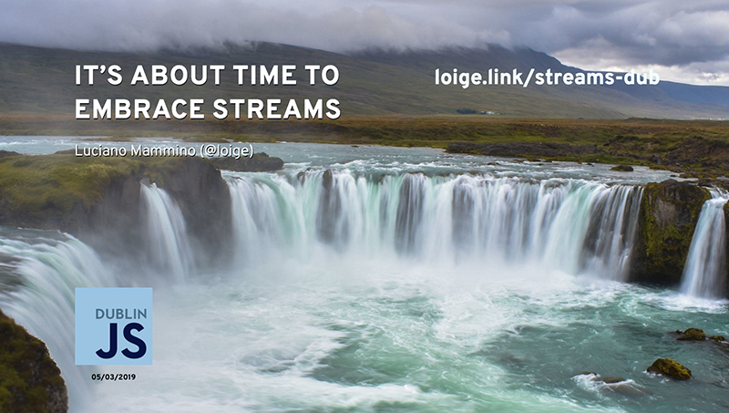
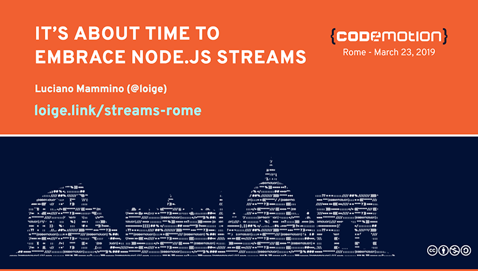
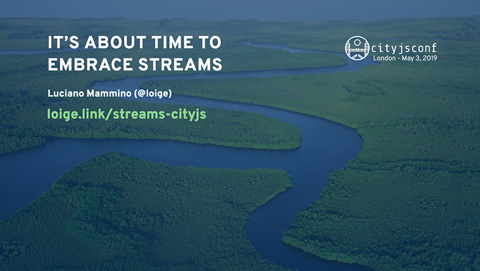
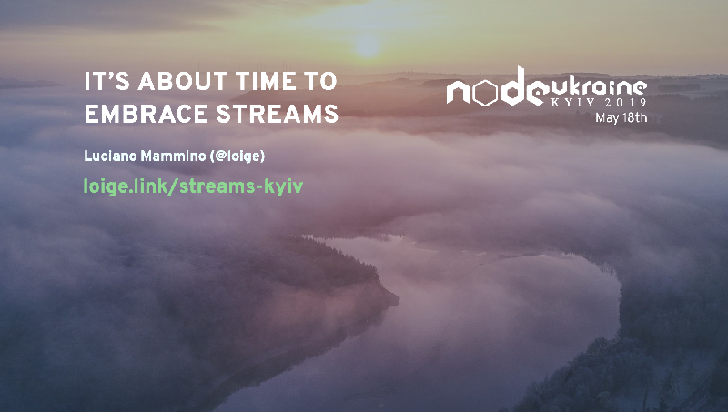

# streams-examples

This repository contains the examples used for my talk **It's about time to embrace (Node.js) streams**,
which explains Node.js streams main concepts.

If you haven't seen this talk, make sure to checkout the slides to be able to fully
enjoy the examples here.

These are different versions of this presentation from some of my previous talks:

### Dublin JS (meetup)

### Codemotion Rome

### CityJS London

### Node Ukraine

### Node.js Austin Meetup

## Requirements

Make sure you are running a recent Node.js version (v10+) and that you have installed
all dependencies with `npm install`

## Source code & building

All examples are available in [`src`](./src).

The browser example (`src/browser`) requires you to build the browser bundle using
Webpack. You can do that by running `npm run build`.

## Contributing

Everyone is very welcome to contribute to this project. You can contribute just by submitting bugs or
suggesting improvements by [opening an issue on GitHub](https://github.com/lmammino/streams-examples/issues).

You can also submit PRs as long as you adhere with the code standards and write tests for the proposed changes.

## License

Licensed under [MIT License](LICENSE). © Luciano Mammino.
